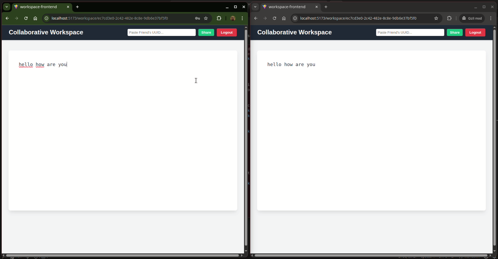

# Collaborative Workspace - Frontend

Secure collaborative text editing platform. This React application allows users to create isolated document workspaces, invite friends, and type together in real time.

## ✨ Features

* **Real Time Collaboration:** Live text syncing powered by WebSockets and STOMP.
* **Secure Authentication:** User registration and login flows protected by JWT.
* **Access Control:** Only Document Owners can share or delete workspaces.

## 🛠️ Tech Stack

* **Framework:** React.js
* **HTTP Client:** Axios
* **Real Time Communication:** SockJS & STOMP.js (for WebSocket connections)

## 🚀 Getting Started

Follow these instructions to get a copy of the project up and running on your local machine.

### Prerequisites

* Node.js (v16 or higher recommended)
* npm or yarn
* The **Collaborative Workspace Backend** (Spring Boot) must be running locally on port `8080`.

### Installation

1. Clone the repository:
   ```bash
   git clone https://github.com/bsametarman/collaborative-workspace-frontend
   
   npm install
   
   npm start / npm run dev

## Demo Video

